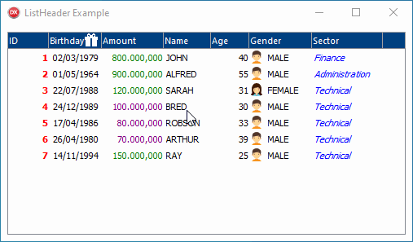
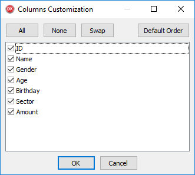

# DzListHeader

## Delphi visual control to create a listbox columns header




- [What's New](#whats-new)
- [Component Description](#component-description)
- [Installing](#installing)
- [How to use](#how-to-use)
- [OnDrawItem usage](#ondrawitem-usage)
- [Working with Tabbed Text](#working-with-tabbed-text)
- [Customize Dialog](#customize-dialog)
- [Properties](#properties)
- [Column properties](#column-properties)
- [Procedures/Functions](#proceduresfunctions)
- [Column Procedures/Functions](#column-proceduresfunctions)
- [Events](#events)

## What's New

- 10/31/2020 (Version 1.3)

   - Included Delphi 10.4 auto-install support.

- 10/27/2020 (Version 1.2)

   - Fixed previous Delphi versions (at least on XE2, XE3, XE4 and XE5) package tag. It was causing package compilation error.
   - Fixed the use of System.ImageList unit in Demo project because it's only available from XE8.

- 10/26/2020 (Version 1.1)

   - Updated CompInstall to version 2.0 (now supports GitHub auto-update)

- 05/03/2020

   - Updated CompInstall to version 1.2

- 02/11/2019

   - Include auto install app

- 02/08/2019

   - Component renamed. Please full uninstall previous version before installing this version. :warning:

- 02/07/2019

   - Add Win64 support (library folders changed!) :warning:

## Component Description

When you are using listbox, and usually when assigning objects to listbox items, you want to show/draw columns in the listbox, using OnDrawItem event.

That's OK, but you don't have a header control to show the columns, and neither allow user to resize, to move, and show/hide columns.

The THeaderControl (Delphi default control) allows some of these operations, but you need to write lots of code for every single listbox, taking care of repainting items and calculating columns positions. And, of course, you don't have hide/show column function available.

So, I have been working on this component, and I decided to share it, because it's very useful.

In addition, the DzListHeader displays a scroll bar when the columns oversizes the visible area. :smile:

## Installing

### Auto install

Close Delphi IDE and run **CompInstall.exe** app to auto install component into Delphi.

### Manual install

1. Open **DzListHeader** package in Delphi.
2. Ensure **Win32** Platform and **Release** config are selected.
3. Then **Build** and **Install**.
4. If you want to use Win64 platform, select this platform and Build again.
5. Add sub-path Win32\Release to the Library paths at Tools\Options using 32-bit option, and if you have compiled to 64 bit platform, add sub-path Win64\Release using 64-bit option.
6. Run **AfterBuild.bat** to publish DFM to Release folders.

Supports Delphi XE2..Delphi 10.4

## How to use

Drop the DzListHeader in a Form, then drop a ListBox inside the DzListHeader.

**Set the DzListHeader.ListBox = ListBox.**

Create desired columns at DzListHeader.Columns property (you should see the columns at design-time).

Then write OnDrawItem of DzListHeader (not OnDrawItem of ListBox - leave this unassigned). Call the method DzListHeader.DwCol to easily draw every single column.

Please see Example folder to know the basic functions.

## OnDrawItem usage

You should write OnDrawItem of DzListHeader (not ListBox), following this idea:

```delphi
procedure TForm1.DzListHeaderDrawItem(Control: TWinControl; Index: Integer; Rect: TRect;
  State: TOwnerDrawState);
var P: TPerson;
begin
  P := TPerson(ListBox.Items.Objects[Index]);

  DzListHeader.DwCol(0, Rect, P.ID);
  DzListHeader.DwCol(1, Rect, P.Name);
  DzListHeader.DwCol(2, Rect, P.Gender);
end;
```
Simply like that!

## Working with Tabbed Text

This component offers a second option of usage, so you don't need to use objects, and you don't need to write code to draw items.
In this option, you should add items with text cells separated by Tab character.

Let's assume you have following table:

| ID | Name | Phone |
| ---: | --- | --- |
| 1 | JHON | 1111-2222 |
| 2 | SARAH | 3333-4444 |
| 3 | ALFRED | 5555-6666 |

So you just enable AutoDrawTabbedText property and add items to ListBox having cells separated by Tab character, like that:

```
1[TAB]JHON[TAB]1111-2222
2[TAB]SARAH[TAB]3333-4444
3[TAB]ALFRED[TAB]5555-6666
```

> **Note: [TAB] represents #9 character**

Then just configure desired columns. In this example will be columns: ID, Name, Phone.
Without any line of code, this will print all items in the list and aligned by columns parameters.

If you want to add items at run-time, you can use AddItem function, specifying an array of strings that will be converted in tabbed separated text.

You may need to use OnDrawItem with tabbed text to customize cells draw. In this case, you should leave the AutoDrawTabbedText disabled and write event OnDrawItem, and then use GetItemArray to extract an array of the current item, having cells separated to draw using DwCol method.

## Customize Dialog

To open Customize Dialog, just right-click at any part of header or columns.
In Customize Dialog you can reorder columns, show/hide columns and set the default order.

## Properties

`AllowMoving: Boolean` = Enable/Disable columns repositioning

`AllowResize: Boolean` = Enable/Disable columns moving (if false, Column.Sizeable doesn't matters)

`AutoDrawTabbedText: Boolean` = When using AutoDrawTabbedText, you don't need to use objects or OnDrawItem. You may add items to the ListBox with Tab delimiter to split columns. In this case, you don't need to code to draw items. There are two methods available to use with tabbed text: AddItem (add item array, so the component automatically converts in tabbed text); GetArrayText (returns an array of requested index).
*You can still leave this property disabled and work with tabbed text, writing event OnDrawItem and using GetArrayText to read text of columns separated.*

`ColorNormalCol: TColor` = Column background color

`ColorHoverCol: TColor` = Column background color when mouse over the column

`ColorLineNormal: TColor` = Line background color (on listbox) when not odd line (or UseOdd disabled), and not selected line

`ColorLineOdd: TColor` = Line background color when odd line and UseOdd enabled

`ColorLineSel: TColor` = Line background color when line is selected

`ColorShape: TColor` = Color of dash that's indicate moving or resizing orientation

`Columns: TDzListHeaderColumns` = Columns Collection

`HeaderHeight: Integer` = Fixed Header Height (you can type multiple-lines in Column Caption if you want)

`LineCenter: Boolean` = indicates DwCol function draws text centralized vertically according to the line height

`LineTop: Integer` = indicates the Y position of text to the DwCol when LineCenter is False

**`ListBox: TCustomListBox`** = *ListBox object (required!)*

`TextMargin: Integer` = Space in Pixels at left and right of column (used so that the text in one column does not stick to the text in another column)

`TitleFont: TFont` = Title Font for Columns captions

`UseOdd: Boolean` = use specific color background for odd lines (see ColorLineOdd property)

## Column properties

`Alignment: TAlignment` = Indicates alignment of text used on DwCol function

`Caption: String` = The caption text of column title

`CaptionEx: String` = This caption is optional, used if you want to specify a full caption to display in Customize Dialog (e.g.: Caption: "ID", CaptionEx: "ID of Person")

`Customizable: Boolean` = Allow the column to be customizable on Customize Dialog

`CustomTextFont: Boolean` = Determines stored for TextFont property (is automatically set when TextFont changes)

`Hint: String` = Column Hint

`MaxWidth: Integer` = Column MaxWidth when resizing

`MinWidth: Integer` = Column MinWidth when resizing

`Name: String` = Column Name to find the column (ColByName function) and for Save/Load customization (SaveCustom/LoadCustom functions).
*The customization requires column name because you may change your project, and in this case the columns will be kept in correct order based on columns names.*

`Sizeable: Boolean` = Allow column resize

`TextFont: TFont` = Font used by Canvas to draw item text for this column (if not changed, canvas uses ListBox font to draw items)

`Visible: Boolean` = Show/Hide column

`Width: Integer` = Column width

`Data: Pointer` = Pointer to free use (non published property)

## Procedures/Functions

```delphi
procedure LoadCustom(const A: String);
```
Loads column customization from string, including position, size, and visibility.
You can load from registry/ini file.

```delphi
function SaveCustom: String;
```
Save columns customization to string, including position, size, and visibility.
You can save to registry/ini file.

```delphi
function ColByID(ID: Integer): TDzListHeaderCol;
```
Returns a TDzListHeaderCol by column ID. The ID remains fixed when moving columns (the position of column is defined by Index property).

```delphi
function ColByName(const aName: String): TDzListHeaderCol;
```
Returns a TDzListHeaderCol by column Name.

```delphi
procedure DwCol(ID: Integer; Rect: TRect; const Value: Variant; Margin: Integer = 0);
```
Used at OnDrawItem, to draw a column item text.
The ID represents the column number considering the order in collection. So, even when the columns are moved at run-time, the ID remains always the same. This is the main identification of the column.
The value represents the text to be printed. Note that the value is variant type, so you don't need to convert to string, unless you want to format the value, of course.
You can specify a margin at the left side of the column, to draw an icon or other custom draw (see example source).

```delphi
function AddItem(const Ar: TArray<String>): Integer;
```
This function helps you to add an item to ListBox, automatically separating array strings with a tab character. You should use this function only when you are storing data into ListBox using tabbed delimiter method. Usually you will want to use this along with the AutoDrawTabbedText property, so you don't need to write OnDrawItem.

```delphi
function GetItemArray(Index: Integer): TArray<String>;
```
Returns an array of strings relative to the Index in ListBox, considering item text has data separated by a tab character.
You can quickly read a cell using `GetItemArray(Index)[Column]`.

## Column Procedures/Functions

```delphi
function GetLeft: Integer;
```
Returns left position of column according by rect bounds.

```delphi
function GetRight: Integer;
```
Returns right position of column according by rect bounds.

## Events

```delphi
procedure OnColumnClick(Sender: TObject; Col: TDzListHeaderCol);
```
Occurs when left-clicked on a column.

```delphi
procedure OnColumnDraw(Sender: TObject; Col: TDzListHeaderCol; Canvas: TCanvas; Rect: TRect; Hover: Boolean);
```
If you set this event, you can catch the time of column title draw, allowing you to change the canvas or adding some to current painted column.
When the event fires, the column is already painted, but not painted into screen, because an internal bitmap is used. So this event allows you to change this bitmap canvas. When the event terminates, the bitmap is painted into screen.
Hover parameter indicates mouse is over the column at this moment.

```delphi
procedure OnColumnRClick(Sender: TObject; Col: TDzListHeaderCol);
```
Occurs when right-clicked on a column.

```delphi
procedure OnColumnResize(Sender: TObject; Col: TDzListHeaderCol);
```
Occurs after a column was resized.

```delphi
procedure OnDrawItem(Control: TWinControl; Index: Integer; Rect: TRect; State: TOwnerDrawState);
```
You should used this event to write all columns, using DwCol method (please see example source).
> **This event won't fire if you are using AutoDrawTabbedText=True**

```delphi
procedure MouseEnterCol(Sender: TObject; Col: TDzListHeaderCol);
```
Occurs when mouse enters a column area.

```delphi
procedure MouseLeaveCol(Sender: TObject; Col: TDzListHeaderCol);
```
Occurs when mouse leaves a column area.
